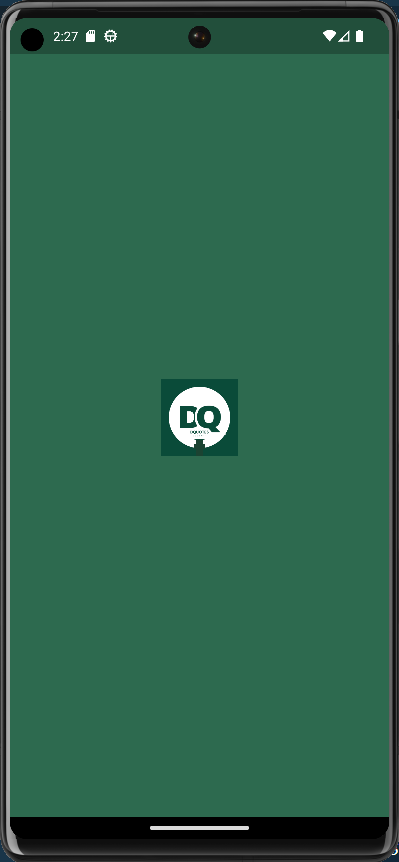
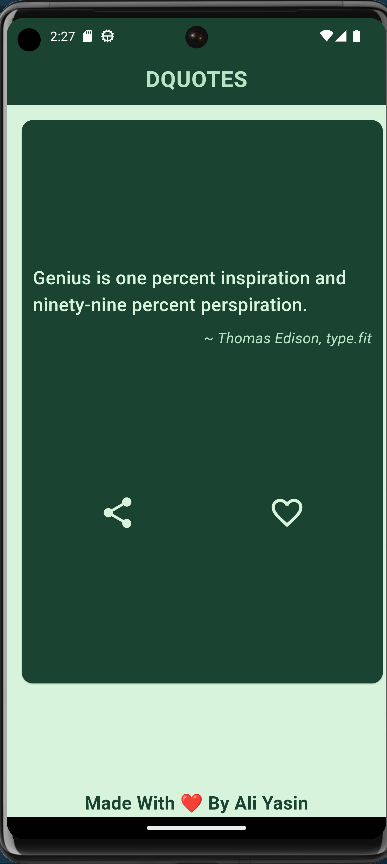
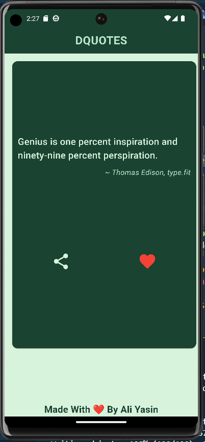
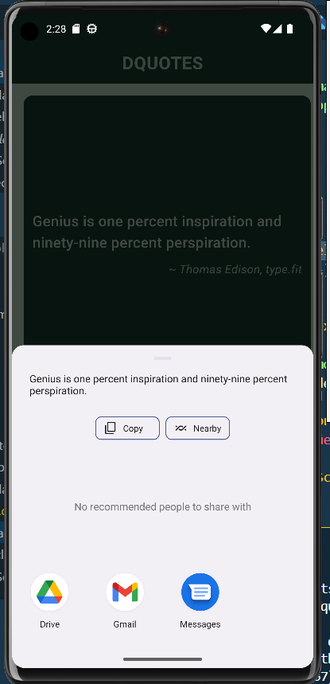

# Quotes App

A simple Flutter app that displays inspirational quotes.

## Getting Started

This project serves as a starting point for building a Flutter application. If this is your first time working with Flutter, consider checking out the following resources:

- Flutter Documentation
- Flutter Cookbook

## Screenshots

Here are some screenshots from the app:

1.  2. 
3.  4. 

## Features

- View a list of inspirational quotes.
- Tap on a quote to view details.
- Mark quotes as favorites.
- Customize app settings.

## Installation

1. Clone this repository.
2. Run `flutter pub get` to install dependencies.
3. Launch the app using `flutter run`.

## Contributing

Contributions are welcome! Feel free to open issues or submit pull requests.

## License

This project is licensed under the MIT License - see the LICENSE file for details.
